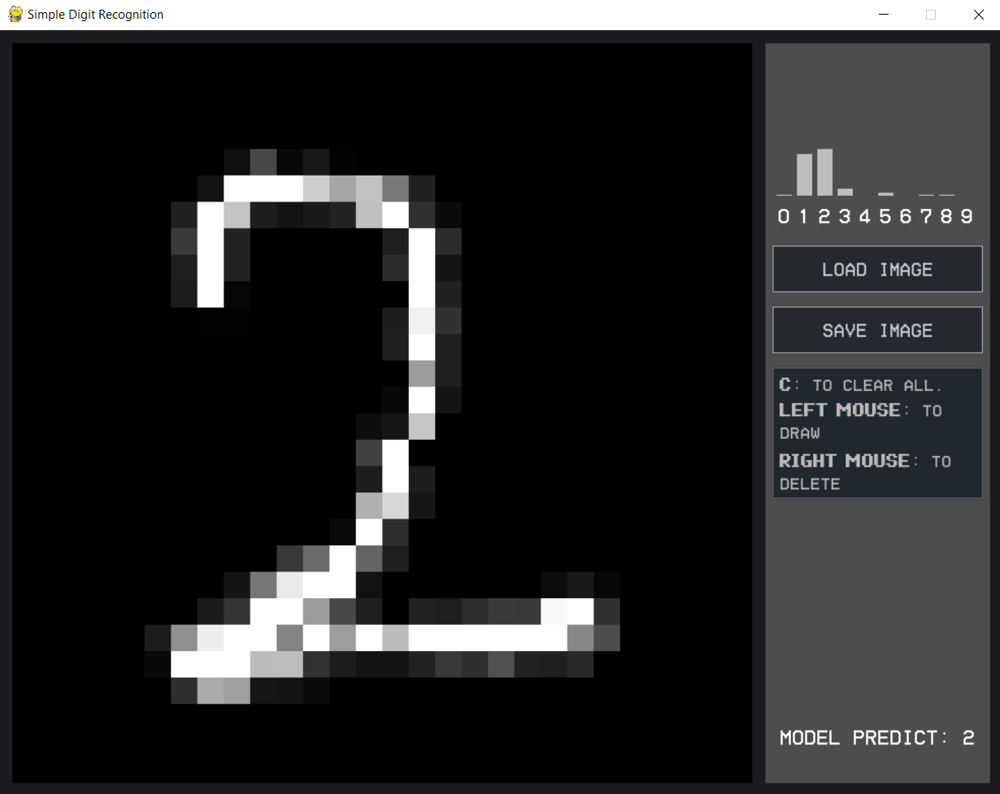

# Simple Digit Recognition

<p align="center">
    <i>Minimalistic implementation of a simple feedforward Neural Network</i>
</p>
<hr />

## Setup
This project requires [Poetry](https://python-poetry.org/) to install the required dependencies.
Check out [this link](https://python-poetry.org/docs/) to install Poetry on your operating system.

Make sure you have installed [Python](https://www.python.org/downloads/) 3.8 or higher! Otherwise Step 3 will let you know that you have no compatible Python version installed.

1. Clone/Download this repository
2. Navigate to the root of the repository
3. Run ```poetry install``` to create a virtual environment with Poetry
4. Run ```poetry run python Main.py``` to run the program. Alternatively you can run ```poetry shell``` followed by ```python Main.py```
<hr />

## Screenshots
<p align="center">

</p>
